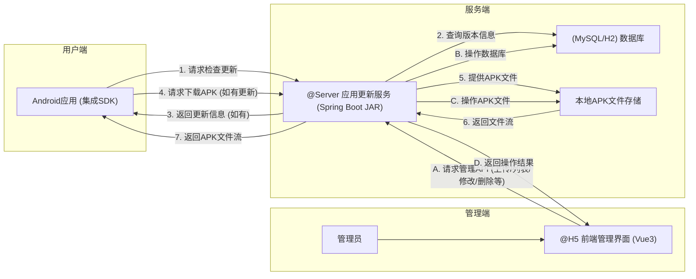

# 项目概述

## 1. 项目背景

为了向公司内部开发的Android应用提供一个统一、便捷、自主可控的应用内更新机制，避免依赖外部应用商店，并能灵活管理版本发布和更新策略，特开发本应用内更新系统。

该系统旨在简化Android应用的更新流程，确保用户能及时获取最新版本，同时为管理员提供方便的版本管理工具。

## 2. 项目目标

本项目旨在构建一个轻量级、易于集成和维护的应用内更新系统，主要目标包括：

- **服务端 (@Server)**: 开发一个稳定、高效的Java服务端应用 (JAR包部署)，负责处理应用版本管理 (APK上传、信息存储)、更新检查API和文件下载服务。
- **前端管理界面 (@H5)**: 构建一个用户友好的Vue3前端管理界面，方便应用管理员上传APK、管理应用信息和版本（列表、修改、启用/禁用、删除）。
- **Android SDK**: 提供一个简单易用的Android SDK，便于公司内部Android应用快速集成应用内更新功能，最低兼容Android 6.0 (API 23)。
- **核心功能**: 实现包括版本检查、APK下载、安装引导、强制更新与可选更新等基本更新场景。
- **易用性**: 关注系统的快速部署和简单操作。

## 3. 系统组件与交互

系统主要由以下三个核心组件构成，它们之间的交互如下：

### 3.1 服务端 (@Server)
- **技术栈**: Spring Boot, Java, Maven, MySQL/H2, 本地文件存储。
- **职责**: 
    - 提供RESTful API供前端管理界面和Android SDK调用。
    - 处理APK文件上传、解析、存储。
    - 管理应用信息 (`app_info`) 和版本信息 (`app_version`) 到数据库。
    - 实现版本检查逻辑，向SDK返回更新详情。
    - 提供APK文件下载服务。

### 3.2 前端管理界面 (@H5)
- **技术栈**: Vue 3, TypeScript, Vite, Element Plus, Axios.
- **职责**:
    - 为管理员提供Web界面。
    - 上传新的APK安装包到服务端。
    - 查看已创建的应用列表。
    - 管理特定应用的版本列表（增、删、改、查、状态切换）。
    - 配置版本的更新说明、是否强制更新等。

### 3.3 Android SDK
- **集成方式**: 作为AAR库集成到目标Android应用中。
- **职责**:
    - 初始化配置 (服务端地址, 当前应用ID)。
    - 调用服务端API检查应用是否有新版本。
    - 解析服务端返回的更新信息，判断是否需要更新。
    - 根据更新信息（如是否强制更新）向用户展示更新提示UI。
    - 下载新版本APK文件（支持进度回调）。
    - 引导用户安装已下载的APK。
    - 处理下载过程中的各种异常情况。

## 4. 核心功能概览

### 4.1 服务端功能
- **应用管理**: 隐式创建 (首次上传某 `appId` 的APK时自动创建对应的 `app_info`)。
- **版本管理**: APK上传、版本信息存储、版本列表查询、版本信息修改、版本删除、版本状态切换。
- **APK解析**: 自动解析上传的APK文件，提取包名、版本号、版本名等。
- **更新检查**: 根据应用ID和当前版本号，返回可用的最新启用版本。
- **文件服务**: 安全存储APK文件，提供下载。

### 4.2 前端 (@H5) 功能
- **应用列表**: 展示、搜索公司内已接入更新服务的应用。
- **版本管理**: 针对特定应用，展示其所有历史版本，并进行管理操作。
- **APK上传**: 提供文件上传界面，并附带版本信息（如更新描述、是否强制）。
- **信息展示**: 清晰展示APK解析出的信息和已配置的版本详情。

### 4.3 移动端SDK功能
- **自动/手动更新检查**: 可配置的更新检查时机。
- **版本比对与更新提示**: 友好的用户提示（强制/可选更新对话框）。
- **后台下载与进度通知**: 支持后台下载APK，并在通知栏显示进度。
- **APK安装引导**: 下载完成后引导用户进行安装 (处理Android 8.0+未知来源权限)。
- **错误处理**: 完善的网络错误、下载错误处理机制。

## 5. 技术栈总结

- **服务端**: Java (Spring Boot), MySQL/H2, Maven, 本地文件存储。
- **前端 (@H5)**: Vue 3, TypeScript, Vite, Element Plus, Axios, Pinia (可选)。
- **移动端 (SDK)**: Kotlin/Java, OkHttp (或其他网络库), Android原生API。

*(详细的技术规范请参考各自的文档)*

## 6. 项目成员和职责

- **项目经理**：负责整体项目规划和协调
- **后端开发人员**：服务端API设计和实现
- **前端开发人员**：管理界面设计和实现
- **Android开发人员**：移动端SDK开发和集成示例
- **测试人员**：功能测试和性能测试
- **运维人员**：系统部署和运维

## 7. 与其他系统的关系

应用内更新系统可以与以下系统集成或协作：

- **CI/CD系统**：自动构建完成后可直接上传新版本
- **监控系统**：监控服务健康状态和性能指标
- **日志系统**：收集和分析系统运行日志
- **用户反馈系统**：收集用户对新版本的反馈

## 8. 项目里程碑

| 里程碑 | 预计完成时间 | 主要内容 |
|-------|------------|---------|
| 需求分析和设计 | 第1周 | 完成需求分析和系统设计 |
| 基础设施搭建 | 第3周 | 完成服务端和前端项目初始化 |
| 核心功能开发 | 第6周 | 完成主要功能的开发和单元测试 |
| 系统集成和测试 | 第8周 | 完成系统集成和功能测试 |
| 部署和验收 | 第9周 | 系统部署和验收测试 | 